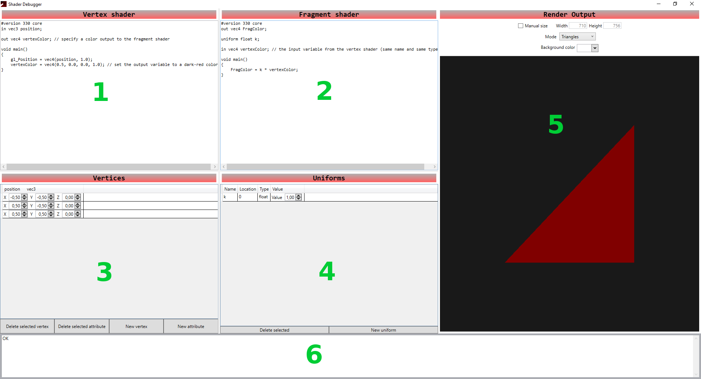
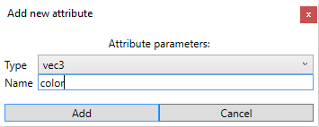

Shader Debugger - User Documentation
================================

How to build
------------------
Build the application using Microsoft Visual Studio (preferably VS2017 or newer). All the NuGet packages should be downloaded automatically by Visual Studio. 

User interface
-------------------
The whole UI consists of one window, which is described in this section.

1. Vertex shader code editor
2. Fragment shader code editor
3. Vertices editor
4. Uniforms editor
5. Render output screen
6. Shader compilation error output

### Vertex shader code editor
Here you can write your vertex shader code. 

### Fragment shader code editor
Here you can write your fragment shader code.

### Vertices editor
Here you can edit what vertex data will be buffered to OpenGL. It shows vertices in a grid, where each row represents a vertex and each column is one attribute. All the displayed values can be changed, which will automatically rebuffer the vertex data. 

The buttons below have following functions:

* **Delete selected vertex** - deletes the selected vertex (row in grid)
* **Delete selected attribute** - deletes the selected attribute (column of a cell that is selected)
* **New vertex** - inserts a new vertes with default values for current attributes
* **New attribute** - invokes "New attribute" dialog

### New attribute
This windows is used for creating new attributes. Select a type from *combo box* and type a name for the new attribute. The name must be of valid format (starts with letter, only alphanumeric characters and "_" allowed inside).

### Uniforms editor
Here you can edit uniform variables of OpenGL shader program. Uniforms are shown in a grid, where each row represents a single uniform. Columns show these properties of a uniform variable:

* **Name** - name (as in the shaders)
* **Location** - location that this uniform is bound to (it is updated automatically).
* **Type** - type of the uniform
* **Value** - the actual value of the variable that can be modified

Buttons have the following functions:

* **Delete selected** - delete selected uniforms (rows in grid)
* **New uniform** - show "New uniform" dialog, which works just like the "New attribute" dialog

### Editing variables
All displayed variables (whether attribute or uniform) can be edited with their respective controls. For example *vec3* variable control will show its *X*, *Y*, *Z* values as three *spinners*, that can be used to modify the variable.

### Render output screen
Here the result of the OpenGL draw call can be seen. The rendered image is updated with every change of input data (shader code, vertices, uniforms). In the upper part you can change the rendering process:

* **Manual size** - choose this to set the viewport dimensions manually (and not by the size of render control)
* **Mode** - choose the mode that OpenGL uses to construct the primitives from vertices
* **Background color** - *color picker* control that allows you to change the *clear color* of OpenGL

### Shader compilation error output
Here you can see the error message produced by OpenGL shader compilator and linker. If compilation and linkage is successful it show message "OK".

